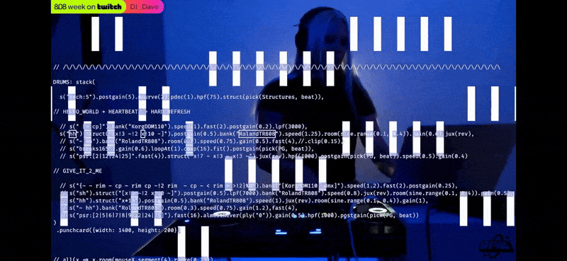

<p align="center">
  
</p>

## System Architecture
```mermaid
flowchart TD
    A[Open MIDI dataset] -->
    B[Preprocessing – parse notes and durations, tokenize]
    B --> C[Target generation – convert to Strudel pattern templates]
    C --> D[Paired dataset – input MIDI tokens, output Strudel strings]
    D --> E[Seq2Seq Transformer – train, validate, tune hyperparameters]
    E --> F[Evaluation – BLEU, validity, loss curves]
    F --> G[Generated Strudel code – detokenize and save .js snippet]
    G --> H[Browser Strudel engine – audition generated pattern]
    style A fill:#d9f5ff,stroke:#0077b6,color:#000
    style B fill:#e6ffe6,stroke:#228B22,color:#000
    style C fill:#fff6cc,stroke:#b59d00,color:#000
    style D fill:#f0e6ff,stroke:#6a0dad,color:#000
    style E fill:#cce0ff,stroke:#0050a0,color:#000
    style F fill:#ffd9d9,stroke:#b30000,color:#000
    style G fill:#ffe6cc,stroke:#cc6600,color:#000
    style H fill:#f9f9f9,stroke:#555,color:#000